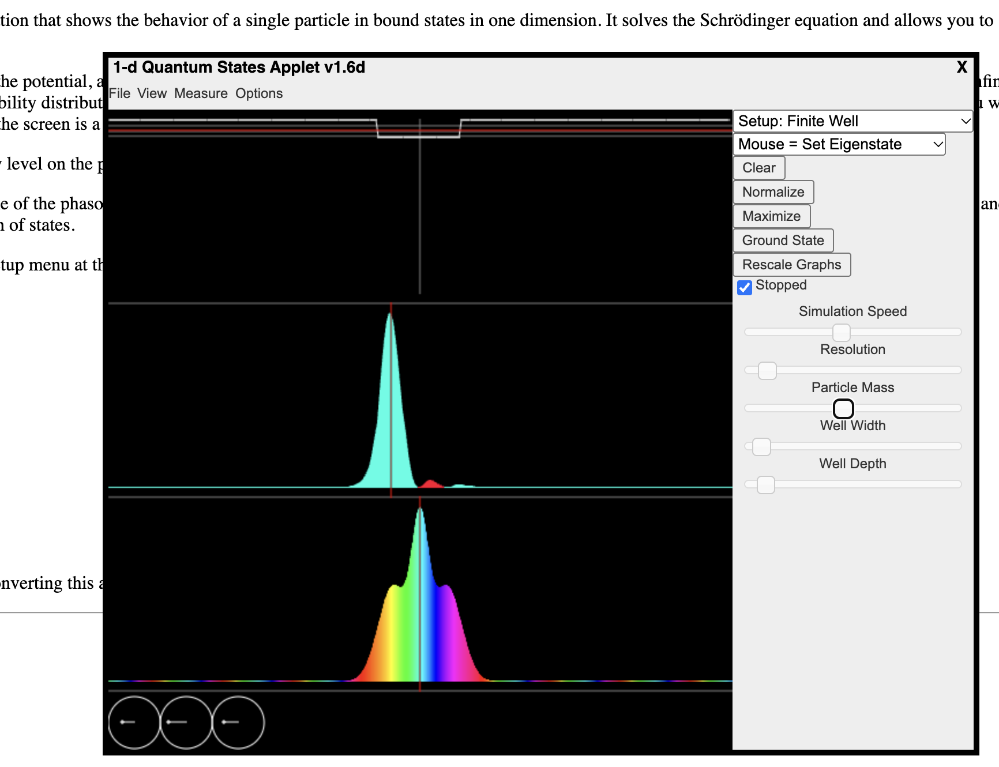

# Complex waves in quantum mechanics

Notes from a conversation (Oct 9–10, 2026). The question was where complex numbers actually show up in physics, which led into exploring an electron's wave in a simulator.

**Simulation:** Falstad's 1D Quantum Mechanics applet: https://www.falstad.com/qm1d/

*Screenshot: Setup = Finite Well, made narrow and shallow, with **Stopped** ticked, right after Measure → Position. Time is frozen, so the position graph (middle) still shows the spike. The momentum graph (bottom) is wide: sharp position, spread-out momentum. This well has only **3 allowed energies** (3 circles), so the spike can only be built from 3 waves. That's why it isn't razor-thin, and why the small red and cyan bumps beside it show leftover wiggles that 3 waves can't cancel. All three clock hands point the same way (left), because at the moment of measurement they line up to build the spike.*

*An earlier screenshot (deep, wide well with about 20 allowed energies, taken a moment after measuring) showed the spike already spread across the whole box, with the red average-energy line jumped high up.*

---

## What is complex in quantum theory?

In Newton's mechanics, velocity and acceleration are real, so we use real numbers. In quantum mechanics the complex quantity is the **wavefunction ψ** (the probability amplitude).

- For an electron, every possible position x gets a complex number ψ(x).
- Its **length** says how likely the electron is to be found there: probability = |ψ|².
- Its **angle** (the phase) has no Newtonian equivalent.

Picture ψ at each point as a little clock hand. The length is the probability, and the direction is the phase. As time passes, the hand spins, and higher energy means faster spinning. The Schrödinger equation describes this spinning, and it has an i built in:

    iħ ∂ψ/∂t = Hψ

Without the i, ψ would grow or shrink. With it, ψ rotates.

**Double slit:** each path gives its own clock hand, and you add them. Same direction gives a bright band, opposite directions cancel and give a dark band. Adding probabilities alone can never give zero, so the angle is needed.

**The twist:** you can never measure ψ itself. Everything you measure comes out as a real number. Experiments in 2021 (Renou et al.) showed that a real-number-only quantum theory can't explain certain results, so the complex numbers seem to belong to nature, not just to the maths.

## What can be measured?

Position, momentum, energy, spin (only ever up or down, +½ or −½), photon polarization, arrival time. All are ordinary real numbers on a dial.

Some take only certain allowed values. A hydrogen electron's energy is −13.6/n² eV (−13.6, −3.4, −1.5, …), nothing in between. Heat hydrogen gas and pass its light through a prism and you see a few sharp lines, not a rainbow.

## Same quantities as Newton, different behaviour

The list of quantities barely changes. What changes is that the thing carrying them is a **wave**, and waves impose three constraints:

1. **Not both at once.** Momentum is the wave's wavelength. A narrow bump (sharp position) has to be built from many wavelengths (spread-out momentum). That's the uncertainty principle.
2. **Only some values.** A wave trapped in an atom has to fit without clashing with itself, like a guitar string that only plays certain notes. Each wave that fits has its own energy.
3. **Always probabilities.** The wave is spread out, but a measurement finds the electron in one place. Where it turns up is random, most likely where the wave is biggest (|ψ|²).

## Reading the simulator

- **Top box:** the well the electron is trapped in. Grey horizontal lines are the allowed energies. The **red horizontal line is the average energy**.
- **Middle graph:** position. Height is probability, **colour is the phase** (clock-hand direction). The red vertical line is the average position.
- **Bottom graph:** momentum. Left of centre means moving left, right means moving right. Its red line is the average momentum.
- **Circles:** one per allowed energy. The arrow inside is that energy's clock hand, and its size says how much of that energy is in the mix.

### Why the colour keeps changing

Each point's ψ is an arrow, and it keeps turning. With **one energy**, every arrow spins together at the same speed. The lengths don't change, so the probability doesn't change. Only the colour cycles, and that spin on its own can't be measured. It's like moving every clock in the world forward an hour: nobody notices.

With **two energies**, the two arrows at each point spin at different speeds and get added. They drift in and out of line, so the tall part of the wave moves around. **Movement in quantum mechanics comes from mixing energies.** Only colour *differences* matter.

### Why measuring position switches on all the circles

Measuring doesn't add waves to the old ones. It throws the old wave away and replaces it with a thin spike where the electron was found. The circles can only show the box's allowed shapes, which are smooth humps and wiggles. A spike isn't one of them, so it has to be built by stacking many of them, lined up to add at one spot and cancel everywhere else.

Sound works the same way. A flute holding one note is a single smooth wave. A hand clap is short and sharp, and contains almost every pitch, low and high.

- Before measuring: a smooth wave, made of 1–2 shapes.
- After measuring: a sharp spike, made of many shapes, including the fast-wiggling, high-energy ones.

Consequences visible in the screenshot:
- The **red energy line jumps up**. Pinning the electron down pulled in high-energy waves, so measuring is not passive.
- The **colours go wild**, because the many clock hands spin at different speeds and drift apart, so the spike spreads out.
- The **momentum graph is wide**: sharp position, spread-out momentum. That is the uncertainty principle on screen.

To see the spike itself: tick **Stopped**, then Measure → Position. Untick it to watch the spike spread.

## One electron, one wave: so why many waves?

One electron has one wave, ψ. The "many waves" aren't extra things. They're a **recipe** for describing that one wave.

**Guitar string.** One string, so at any moment one shape. But a plucked shape is complicated, so it's described as a mix of simple pieces:
- the basic note, one smooth hump;
- plus a bit of the next note, two humps;
- plus a little of three humps, and so on.

Each piece is a pure note, and the mix is why a guitar sounds different from a flute playing the same note. There's still only one string with one shape. The pieces just say what it's made of.

**The electron is the same.** The circles in the simulator are the recipe:
- each circle is one pure shape, one allowed energy, like one pure note;
- the arrow in it says how much of that shape is in the mix, and at what angle.

Add up all the pieces and you get the one wave in the middle graph.

**Why use a recipe at all?** Each pure piece is simple in time: it just spins at its own speed and never changes shape. The full wave changes in complicated ways. So the easy way to predict it is to break it into pieces, spin each one, and add them back up. That's what the simulator does every frame.

**Where it gets strange:** when you measure energy, the electron doesn't report the mix. It picks one piece at random, bigger pieces more often, and becomes just that one pure shape.

## Things to try next

- Measure → Energy a few times from the same mix. It snaps to one clean shape, and bigger circles come up more often.
- PhET Quantum Wave Interference (double slit, one electron at a time): https://phet.colorado.edu/en/simulations/quantum-wave-interference
- Falstad Hydrogen Atom (3D): https://www.falstad.com/qmatom/
- PhET Stern–Gerlach (spin): https://phet.colorado.edu/en/simulations/stern-gerlach
