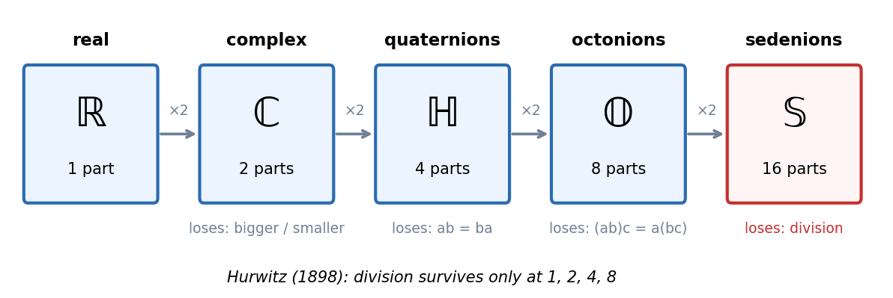
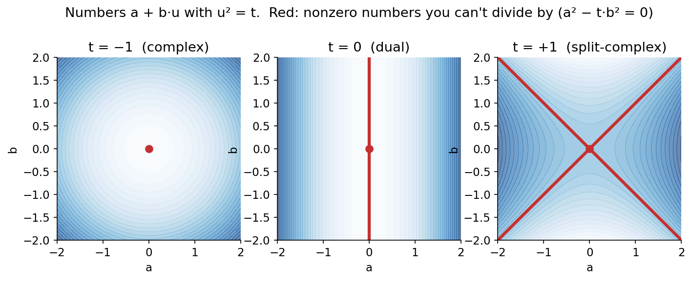
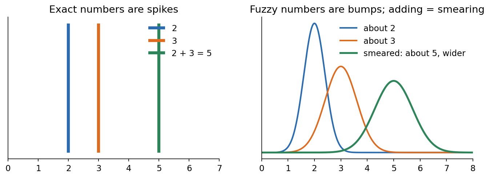
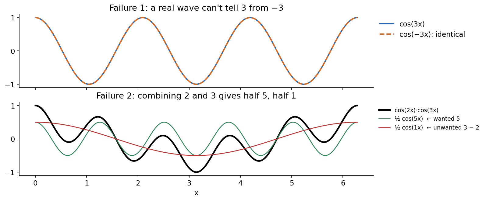
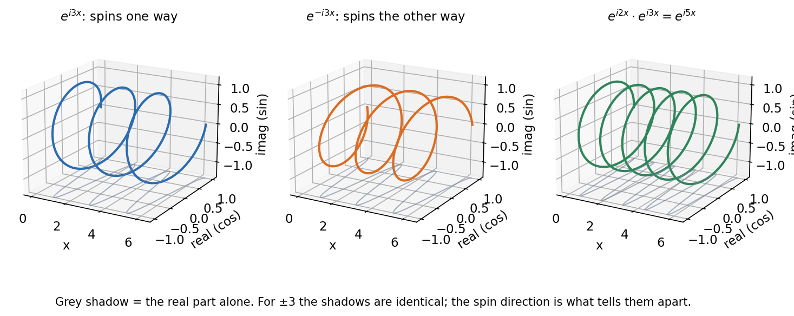
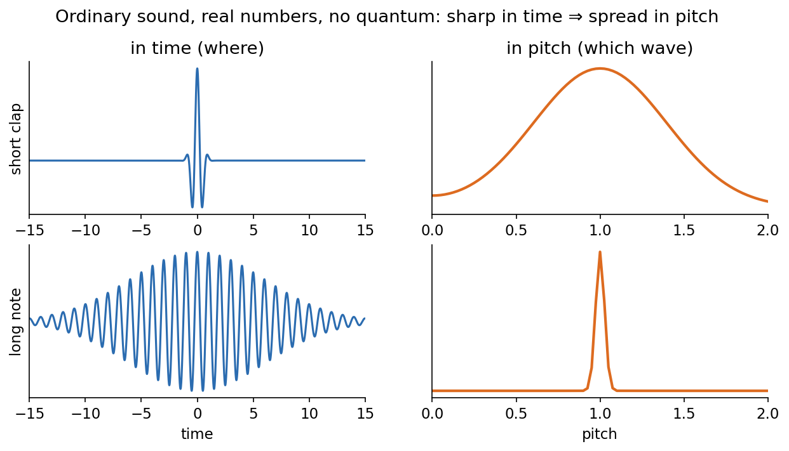
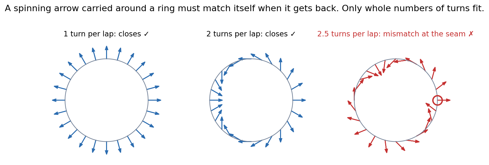

# Numbers as waves

Notes from a conversation (Oct 9–10, 2026). The question: can we invent a new, *continuous* number system? And what if a wave, not a single value, were the number? Following that idea leads straight from the real numbers to the complex numbers, for a reason you can see and check.

---

## 1. The ladder we already have

Each step up builds a new system from pairs of the old one, and each step gives up one rule.

| System | Parts | Built as | What you lose |
|---|---|---|---|
| Real ℝ | 1 | | |
| Complex ℂ | 2 | pair of reals | you can't say which of two numbers is bigger |
| Quaternions ℍ | 4 | pair of complex numbers | order matters: ij = k but ji = −k |
| Octonions 𝕆 | 8 | pair of quaternions | grouping matters: (ab)c ≠ a(bc) |
| Sedenions | 16 | pair of octonions | division: two nonzero numbers can multiply to 0 |

Hurwitz (1898): 1, 2, 4 and 8 are the only sizes where you can always divide and where the size of a product is the product of the sizes.

The systems themselves are continuous. A complex number a + bi can have any real a and b. What's discrete is the *list* of systems: 1, 2, 4, 8, with nothing in between.

So the real question is: **can we make a smooth dial of number systems, not four separate steps?**

---

## 2. Attempt 1: a dial

Take numbers a + b·u, where u is a new symbol, and choose

    u² = t        (t is any real number: the dial)

Multiplying, using u² = t:

    (a + bu)(c + du) = (ac + t·bd) + (ad + bc)u

Turn the dial:

| Setting | Name | What it is |
|---|---|---|
| t = −1 | complex numbers | u is just i |
| t = 0 | dual numbers | u² = 0. They compute derivatives for free: (x + u)² = x² + 2x·u, and 2x is the derivative of x². |
| t = +1 | split-complex numbers | u² = 1 but u isn't ±1. Used for the geometry of special relativity. |

### Can you always divide?

    1 / (a + bu) = (a − bu) / (a² − t·b²)

This breaks whenever a² − t·b² = 0 for a nonzero number.

- **t > 0: fails.** With t = 1: (1 + u)(1 − u) = 1 − u² = 0. Two nonzero numbers multiply to zero.
- **t = 0: fails.** u · u = 0.
- **t < 0: works.** a² − t·b² is always positive.

*Red marks the nonzero numbers you can't divide by. At t = −1 only 0 is red. At t = 0 a whole line is red, and at t = +1 two crossing lines are.*

### The twist

The dial isn't really a dial. If t = −4, then u = 2i, and you just have the complex numbers with a relabeled axis. Every negative t is ℂ in disguise, and every positive t is the split-complex numbers in disguise (u = √t · j, where j² = 1). So the whole dial collapses to **exactly three** systems, and only one of them lets you divide.

This isn't bad luck. Frobenius (1877) and Hurwitz (1898) showed that whenever you insist on division, you get pushed back onto the 1, 2, 4, 8 ladder. **A continuum of division systems can't exist.**

---

## 3. What makes something a "number system"?

The checklist. You only get to call it a number system if it passes the rules you care about.

1. **Closed:** adding or multiplying two of your numbers gives another one of your numbers.
2. **Zero and one:** a + 0 = a and a × 1 = a.
3. **Undo:** you can always subtract, and you can always divide by anything nonzero.
4. **Distributive:** a(b + c) = ab + ac.
5. **Order rules** (optional):
   - ab = ba (quaternions drop this)
   - (ab)c = a(bc) (octonions drop this)
6. **No gaps:** a sequence that keeps closing in on a point actually reaches a number. This is the "analog" or continuous property. Fractions fail it (√2 is missing); the reals pass it.
7. **Size behaves:** |ab| = |a|·|b|.

- Passing 1–4 plus both rules in 5 makes a **field**. Examples: ℚ, ℝ, ℂ, the p-adics, and arithmetic mod 97 (the grokking task).
- Adding 6 makes it **continuous**.
- Adding 7 on top of division puts you on **Hurwitz's 1, 2, 4, 8 ladder**.

To invent something new, you have to choose which rule to break.

---

## 4. Attempt 2: what if a wave is the number?

The thought: we decide to call a point "1". What if we didn't collapse things to a single value, and let a whole wave be a number?

### Why a wave isn't a number (yet)

A wave has a value at every point, so it's infinitely many values at once. You can add waves point by point. But multiplying point by point breaks the checklist (rule 3).

Take two bumps that don't overlap. Wherever one is nonzero, the other is zero. So their product is zero everywhere, even though neither bump is zero. Two nonzero things multiplied to give zero: the same failure as matrices and the dual numbers.

So point-by-point multiplication is the wrong rule. We need a better one.

### Making it work: a real number as a shape

- The number **3** becomes a sharp **spike** sitting at 3.
- A fuzzy number, "about 3", becomes a **bump** around 3.
- To **add** two numbers, smear one shape along the other. This is called **convolution**. It's how you add two dice rolls: the chance of getting 7 counts every way two dice can make 7.

Check: a spike at 2 smeared along a spike at 3 gives a spike at 5. ✓

And for fuzzy numbers: a bump around 2 plus a bump around 3 gives a wider bump around 5. The fuzziness adds up, which is exactly what happens when you add two measurements that each have some error.

So **every real number is already a shape**, and adding numbers is combining shapes.

---

## 5. Looking through Fourier's lens

Smearing is messy to compute. Fourier's trick rewrites any shape as a mix of pure waves. The payoff: **smearing two shapes becomes plain multiplication of their waves.** Adding numbers turns into multiplying waves.

A spike at a turns into a single pure wave whose rate of turning is a. So each real number becomes one wave. Now the question that decides everything: **what kind of wave?**

### Try a real wave: cos(a·x)

It wobbles up and down. It fails twice.

**Failure 1: it can't tell 3 from −3.**

    cos(3x) = cos(−3x)

The wave forgets the sign.

**Failure 2: it multiplies wrong.**

    cos(2x) · cos(3x) = ½·cos(5x) + ½·cos(x)

Combining 2 and 3 should give 5. You get half "5" and half "1", where 1 = 3 − 2. The real wave can't decide between adding and subtracting.

### The fix: give the wave a second channel

Run sin(a·x) alongside cos(a·x). Together the two channels draw an arrow that **spins**, not a line that wobbles:

    cos(ax) + i·sin(ax) = e^{iax}

Now both failures are gone.

- **The sign comes back.** e^{i3x} spins one way and e^{−i3x} spins the other way.
- **Multiplying works.** e^{i2x} · e^{i3x} = e^{i5x}, exactly. Multiplying spinning arrows adds their angles, so 2 and 3 give 5 cleanly.

*Each wave is drawn as a corkscrew: along x, the arrow spins in the (real, imaginary) plane. The grey shadow is cos alone, and it's identical for 3 and −3.*

**Picture a rope.** Shake it up and down and you get a standing wave: you can't tell which way it's going. Swing it like a jump rope and it spins with a clear direction. A real wave wobbles. A complex wave spins. **The i is what stores the direction.**

### Is there a real wave that would work instead?

We need waves where "multiply the waves" means "add the numbers":

    w_a(x) · w_b(x) = w_{a+b}(x)

There is exactly one family of real-valued waves that does this: e^{a·x}. But those aren't waves. They don't wobble, they **blow up**, growing without limit as x gets large. (This is a theorem: the only bounded, continuous solutions are the spinning ones, e^{iax}.)

So the step from ℝ to ℂ is forced:

> If you want a wave that stays bounded **and** turns adding into multiplying, it has to spin. Spinning needs two channels. Two channels are the complex numbers.

Mathematicians call these spinning waves the **characters** of the real numbers, and this idea (each kind of number has its own set of spinning waves) is called Pontryagin duality.

---

## 6. Where this shows up for real

### Quantum mechanics

This is why quantum wave functions have to be complex (see `complex_wave_in_quantum.md`). A real wave function can't carry motion in a particular direction; it would be a standing wave. Experiments in 2021 (Renou et al., *Nature*) tested a version of quantum theory built only on real numbers, and it failed.

### Grokking mod 97 (idea 1)

Networks that learn a + b mod 97 represent each number a as a **pair** (cos(w·a), sin(w·a)), never cos alone. They compute a + b using the rule for multiplying spinning arrows. They found the spinning-arrow trick on their own, for the reason in Section 5: with cos alone, 2 + 3 gets mixed up with 3 − 2. (Nanda et al., 2023, "Progress measures for grokking via mechanistic interpretability.")

For mod p, the waves are e^{2πi·k·a/p}: arrows that go around the circle in p steps and land back where they started, because 97 + 1 wraps around to 1.

---

## 7. Where the wave-number idea still breaks

Being honest about the gaps:

- **Division is still a problem.** Smearing can be undone (deconvolution) only where the wave isn't zero. Two shapes whose Fourier waves never overlap smear together to give exactly zero. So zero-divisors come back, just in a new place. Shapes as numbers form a nice algebra, but not a field.
- **Multiplying numbers needs a different lens.** Our wave-numbers handle adding beautifully. To turn *multiplying* numbers into multiplying waves, you need the waves x^{is} (the Mellin transform), not e^{iax}. The same ideas with these waves lead to the Riemann zeta function.

---

## 8. Threads to pull next

1. **Spinning in 3D.** What if the arrow spins in 3D and not on a flat plane? That's where quaternions come back. Quaternion Fourier transforms exist, but because ij ≠ ji, the "multiply waves = add numbers" trick gets subtle.
2. **Fuzzy numbers as first-class numbers.** A bump is a number together with its uncertainty, and adding bumps adds the uncertainties correctly. Could a calculator that works only on bumps be useful? This is close to how probability distributions add.
3. **Numbers with a frequency limit.** In the Falstad well, a spike could only be built from 3 allowed waves, so it was never razor-thin. What would a number system look like if only a finite set of waves were allowed? Mod-p arithmetic is one answer: p waves, p numbers.
4. **Is there a dial after all?** The dial in Section 2 collapsed to three systems. Is there a continuous family of *wave* number systems, for example by changing what "spinning" means, that doesn't collapse?

Figures are generated by `figures/make_figures.py`.

---

## 9. The big goal: a new language for maths

### In Janhavi's words (as written, Oct 10, 2026)

> know i want to develop a completely new language for maths. hundreds of years ago some person named zero zero and one one and we had been using that system. now we are advanced civilization, our number system needs an update. I am in search for a new number system brother. so that quamtum mechanics and string theyry can feel natural and we won't have to add constraints on what values they can take. you know right now with the complex numbers and real numbers we are like it can take only these values quantized and we can't measure two things at a time. it feels like it is lacking something. quantum is not lacking anything, its' just because our underlying system is done that way and we are defining constraints. I want a fundamental system which is better. so quamtu mthings feel natural and not constrainty.

### Main points from the discussion

**1. Notation has been upgraded before, and each upgrade changed what people could think.**
- Zero as a number with its own rules: Brahmagupta, 628 CE.
- Place-value digits reach Europe: Fibonacci, 1202. Before that, multiplying in Roman numerals was a job for specialists.
- Leibniz's dx (1680s): calculus becomes something you can push symbols around in.
- Dirac's bra-ket notation (1939) and Feynman diagrams (1948): quantum calculations become pictures.

So "our number system needs an update" isn't a crazy wish. It has happened every few hundred years.

**2. The evidence for the intuition: both "constraints" already come out of waves by themselves.**

*Uncertainty isn't a quantum rule. It's what waves do.* A short clap contains almost every pitch, and a long steady note has only one. That's ordinary sound, real numbers, nothing quantum. In quantum mechanics, momentum *is* the pitch of the electron's wave, so "sharp position ⇒ spread momentum" is the same picture.

*Quantization isn't a rule either. It's counting turns.* Carry a spinning arrow once around a ring. When you get back to the start, the arrow has to point where it started, or the wave disagrees with itself at the seam. So it can turn 1, 2 or 3 times per lap, but never 2.5. Each whole number of turns is one allowed energy. Nobody imposes "only these values". You can't wrap a wave around a loop any other way.

So the intuition holds: in point-number language these look like extra rules bolted on, and in wave language they are automatic.

**3. The honest limit.** The *outcomes* are facts about nature, not artifacts of notation. Heat hydrogen and you see sharp coloured lines, whatever symbols you write. A new system can't make those lines continuous. What it *can* do is make them obvious, so that they read as consequences, not constraints. That's the real target:

> A language where quantum behaviour is the default, and the classical world of single exact numbers is the special case.

**4. The core idea of a "wave-number" language (first draft).**

| Today | Wave-number language |
|---|---|
| The basic object is a point (a single value) | The basic object is a wave (a spinning arrow at every place) |
| A measurement *reads* the value | A measurement *makes* a point: a real number is the shadow a wave casts when you ask it a question |
| Quantized values are imposed | Allowed values are the whole numbers of turns that fit |
| Uncertainty is a principle | Uncertainty is how sharp a wave is in one lens versus the other (Fourier) |
| "Can't measure x and p together" is a limitation | x and p are two different lenses on the same wave; "both at once" isn't a meaningful question, like asking for a note's pitch at one instant |

**5. People who attacked pieces of this. Stand on them, don't repeat them.**
- **Heisenberg's matrix mechanics (1925).** He literally replaced numbers with grids of numbers. Position and momentum became matrices with xp − px = iħ. Uncertainty then lives *inside the multiplication rule*, not as an extra law.
- **Noncommutative geometry (Alain Connes).** Geometry built from numbers where ab ≠ ba. Space itself becomes "quantum" in the numbers.
- **Geometric algebra (David Hestenes).** i stops being a mysterious √−1 and becomes a concrete object, a rotation in a plane. Spin falls out naturally.
- **Quantum picturalism / ZX-calculus (Bob Coecke).** Quantum processes as diagrams you can rewrite; a graphical language.
- **Quantum logic (Birkhoff and von Neumann, 1936).** Changes logic itself: "A and (B or C)" is no longer "(A and B) or (A and C)".
- **p-adic string theory (Freund, Witten, Volovich).** String theory redone on the p-adic numbers, whose geometry is fractal.

**6. What would make a new system count.**
1. It reproduces every experiment: interference, the hydrogen lines, |ψ|² probabilities, Bell-inequality violations.
2. And either it's **simpler** (things that needed postulates become theorems), or it **predicts** something the old language can't.

Matching only (1) still counts as notation, and notation counts. Place-value digits predicted nothing new; they changed who could do arithmetic.

**7. First concrete step.** Pick the smallest world and build the whole language there:
- a particle on a ring (one loop, as in the figure above), or
- the mod-p clock from the grokking task (p allowed turns, p numbers).

Write down the objects, how to add and combine them, and what "measure" means. Then check: do quantized values and uncertainty come out **with zero extra rules**? If yes, grow the world: two rings, then a sphere, then spin (quaternions return here).
