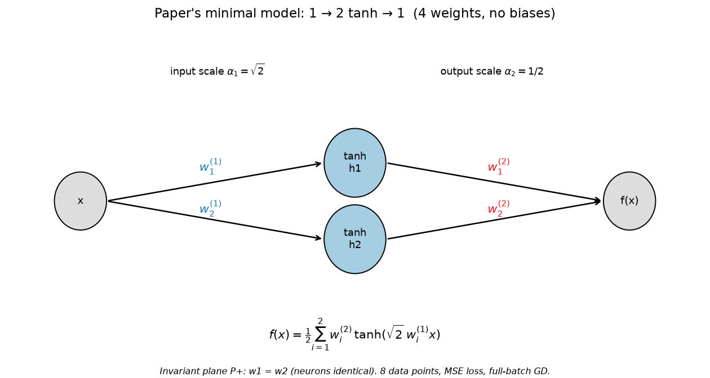
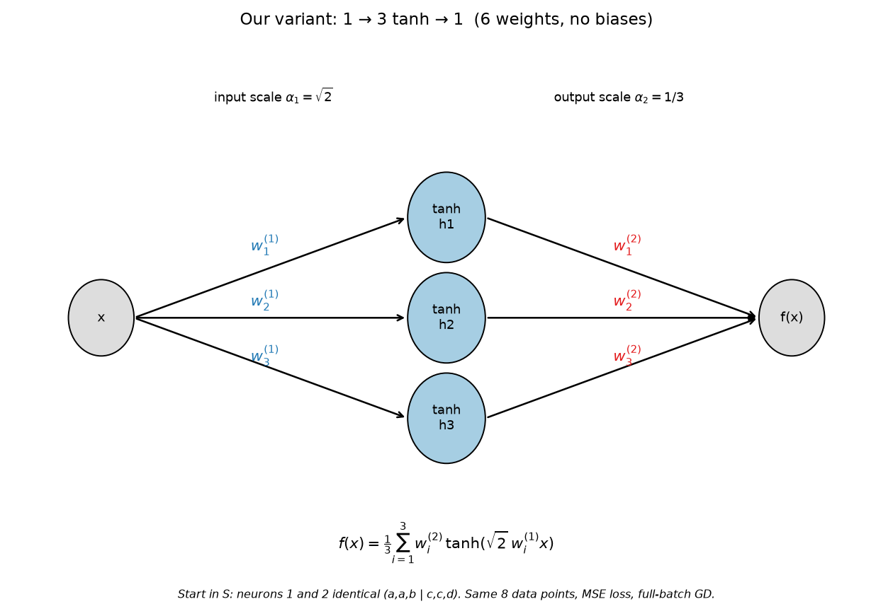
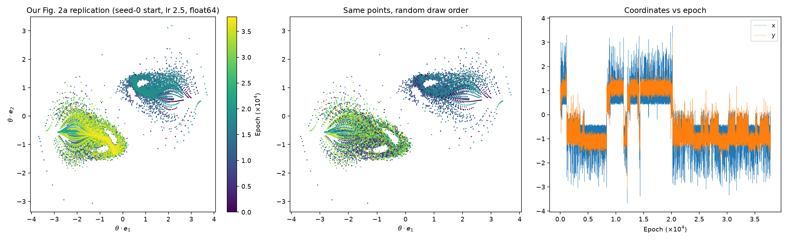
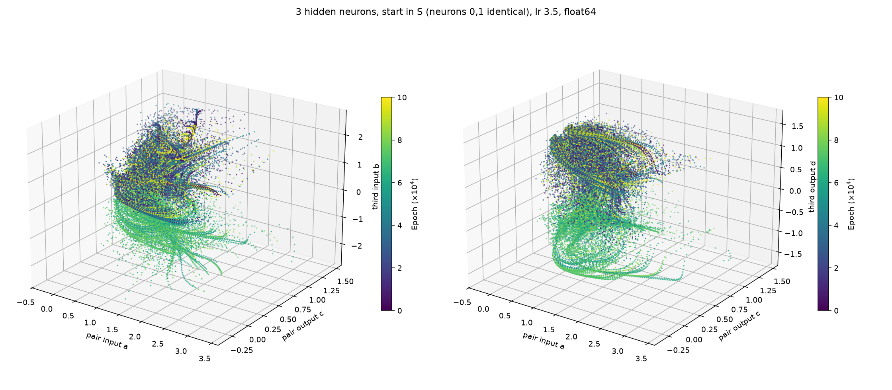
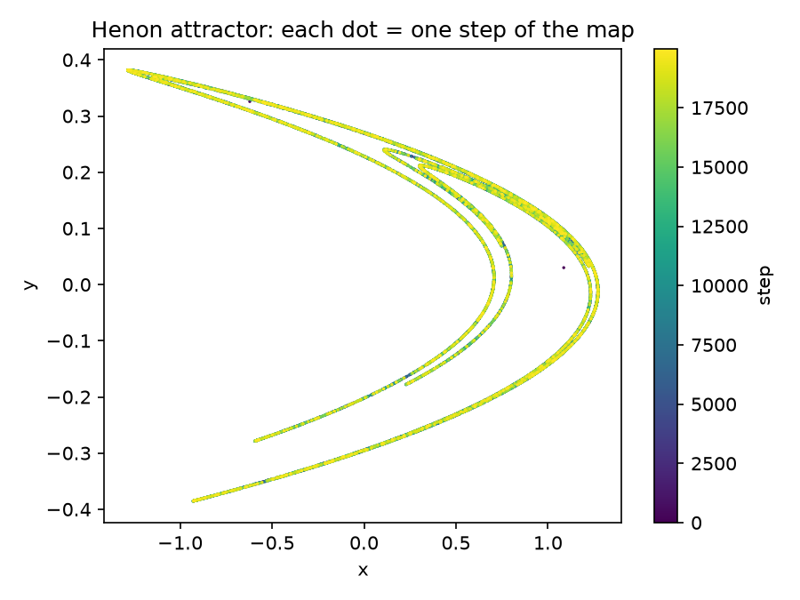

# Replication Plan: Wada Basin Boundaries in Neural Network Training

---

## OUR IDEA (Janhavi, Oct 8, 2026)

**Claim:** In the training of a small neural network, the basin boundaries have the Wada property. Every boundary point touches all the basins (all the minima / outcomes). No boundary point touches only some of them. A start is either deep inside one basin, or on a boundary where all outcomes meet.

```
for every boundary point x, and every radius r > 0:
    the ball B(x, r) contains starts that end in ALL outcomes
```

- Colors are basins (sets of starting weights). Minima are where they end up.
- Wada needs at least 3 outcomes. With 2 it is meaningless.
- This is stronger than "the boundary is fractal" and stronger than "riddled".
- Link to idea 1: if many circuits compete, every dominance shift happens on one shared boundary, not on a bracket of pairwise boundaries (see `../ideas/wada_basins_in_neural_networks.txt`).

**How to read the claim:**
- It is about **boundary points**. A start deep inside a basin touches one basin only, and that is fine.
- "Touches all basins" means every small ball around the point contains starts that end in each of them. A single run is still deterministic and ends in one outcome.
- It says nothing about how much of the space is uncertain. That is the prefactor c, which we measure separately.

**Not yet tested by us.** Nothing below is a result.

---

## PUBLISHED PAPER: "Fractal basin geometry and the limits to predictability and reproducibility in deep learning"

**arXiv ID:** [2510.05606](https://arxiv.org/abs/2510.05606)
**Authors:** Andrew Ly and Pulin Gong (University of Sydney)
**Venue:** to be published in Nature Machine Intelligence (per arXiv comments)
**Code:** https://github.com/anly2178/riddled_basins_neural_network (MIT license)
**Data:** https://doi.org/10.24433/CO.8310374.v1 (Code Ocean)
**Key claim (from the abstract, paraphrased):** training outcomes are governed by fractal, riddled basin geometry. Near any start that reaches one solution, there are starts that reach other solutions, at every scale.

What they did (read from the HTML version and the repo):

- **Minimal model:** two-layer tanh network, 4 parameters, full-batch GD at η = 2.5, 8 Gaussian regression points. Image is a 2047×2047 grid on a random 2D plane through parameter space. Colors: blue → P+, orange → P−, white → infinity or off-plane attractors. That is already **3 colors**.
- **Deep networks:** tapered bias-free VGG-12, 12,036 parameters, SGD, MNIST with 50% label noise, 255×255 grid. Outcomes are labeled by which neurons vanish (1772 neurons). About 500,000 networks trained overall, also ResNet and BERT.
- **Measurements:** uncertainty exponent φ and Lyapunov exponents. φ = 0.0126 ± 0.0002 (minimal model), 0.000 ± 0.002 (VGG-12, GPU and CPU). Functional exponent 0.00 ± 0.01.
- **One-bit test:** the code (`dnn_one_bit.py`) flips the lowest bit of **one** float32 parameter and retrains. The paper reports f(ε) = 0.477 for these flips (VGG-12). I have not read the part of the script that forms pairs.
- **Wada:** not tested in the main text. It only points to Supplementary Sec. 3 about "hyperparameter-space fractality resembling lakes of Wada". I could not read the supplement.
- **Not reported:** the prefactor c, for any network. Per-architecture numbers for ResNet and BERT are in Extended Data and the Supplement, which I did not read.

**Related work:**

- [Testing for Basins of Wada](https://www.nature.com/articles/srep16579) (Daza, Wagemakers, Sanjuán, Yorke, 2015): the merging method.
- Kennedy & Yorke (1991), "Basins of Wada": Wada basins occur in ordinary dissipative systems.
- [The Butterfly Effect](https://arxiv.org/pdf/2506.13234): training is highly sensitive to initial conditions. Findings not read.
- Search of Oct 7 found no paper testing Wada in neural network training. This is five searches, not a literature review.

---

## OVERLAP ANALYSIS

| Aspect | Our Idea | Their Paper | Overlap |
|---|---|---|---|
| Fractal basin boundaries in NN training | Assumed | Shown (φ ≈ 0) | **High** |
| Riddled basins | Implied | Claimed and analysed | **High** |
| Slice method (random 2D plane, color by outcome) | Planned | Used | **Same method** |
| Uncertainty exponent | Planned | Measured | **Same method** |
| Wada property (every boundary point touches ≥ 3 basins) | **Core claim** | Not in main text, only a pointer to the supplement | **Unknown, likely low** |
| Merging test | Planned | Not seen | **None seen** |
| Outcomes = circuits (Fourier signature of logits) | Planned for grokking | Outcomes = vanished-neuron subspaces | **Different** |
| Grokking tasks | Target | Not studied | **None** |
| Prefactor c | Will report | Not reported | **None** |

**Overall overlap: high on fractal and riddled, unknown on Wada.**

Riddled is not Wada. Riddled says every point of a basin has other outcomes arbitrarily close. Wada says every boundary point touches at least 3 basins. Related, but separate tests. Their near-zero exponent supports the fractal part of our claim only.

---

## DECISION: REPLICATE, THEN EXTEND

**Condition:** The slice method and the exponent measurement are published, with code. The Wada test may be unpublished, or only in the supplement.

**Action:**
1. Read Supplementary Sec. 3 first. If they already tested Wada, we replicate that and the idea becomes an extension to grokking.
2. Replicate their minimal-model image and exponent.
3. Run the merging test on it. This is the cheapest Wada test.
4. Move to a small grokking network, with circuits as outcomes.

---

## REPLICATION PLAN (What to Do)

### Phase 0: Read before running (1–2 hours)
- Download the supplement: https://arxiv.org/src/2510.05606v2/anc
- Read Sec. 3 (Wada) and the Methods on how pairs are formed.
- Read the rest of `dnn_one_bit.py`.
- Decide whether the plan below changes.

### Phase 1: Reproduce their minimal model (1 day)
- Clone the repo. Pinned: Python 3.10, JAX 0.6.0, Flax, Optax.
- Run `Code/mnn_main.py` (README: about 12 hours on a normal computer).
- Compare our image and exponent to the paper's: φ ≈ 0.0126.
- Check the Code Ocean data against our output.

### Phase 2: Merging test on the minimal model (1 day)
- Three colors already exist: P+, P−, and white.
- Compute the box-counting dimension of the full boundary.
- Merge each pair of colors in turn, then recompute.
  - **Wada:** dimension unchanged under every merge.
  - **Not Wada:** dimension drops for the merge of the two basins that share a stretch.
- Check the white region first. It lumps several attractors together, so it may need splitting.

### Phase 3: Grokking network (2–3 days)
- Task: modular addition mod 97, small MLP, full batch, deterministic.
- Slice: random 2D plane through initialization space.
- Outcome label: Fourier signature of the logits (which key frequencies the model converges on). This ignores permutation symmetry.
- Count distinct outcomes first. If fewer than 3, stop. Wada is vacuous here.
- Run the merging test and the uncertainty exponent.
- Port the slice-and-train loop to PyTorch (their code is JAX).

### Phase 4: Sweeps and controls (2–3 days)
- **Learning-rate sweep.** Prediction: exponent goes toward 1 (smooth) at small steps. If it stays near 0, our step-size argument is wrong.
- **float32 vs float64.** If the maps differ, we are measuring rounding noise.
- **Many planes, several zoom levels.** One picture proves nothing.
- **Basin entropy** as a second fractality measure.
- **Report the prefactor c.** The paper does not. It decides whether "unpredictable" is a small caveat or the main behavior.

### Phase 5: One-bit test on grokking (1 day, if time)
- Flip one bit in one weight, train, record the circuit signature.
- Repeat over many weights. Report the fraction that change the outcome.

---

## Resource Requirements

| Resource | Requirement | Status |
|---|---|---|
| Minimal model run | about 12 hours (per their README) | Reasonable on a laptop, JAX install untested |
| Grokking slice | e.g. 100×100 grid, 1 run each | Small MLP, full batch, a few minutes per run |
| VGG-12 and ResNet reruns | about 6 weeks on GPU (per their README) | **Not feasible.** Use their Code Ocean data instead |
| Code | JAX (theirs), PyTorch (ours) | Must port the slice loop |
| Storage | CSVs, images | Small |

---

## Success Criteria

- [ ] Reproduce their minimal-model exponent: φ within error of 0.0126.
- [ ] Reproduce their minimal-model image qualitatively.
- [ ] Merging test gives a clear answer on the minimal model (Wada or not).
- [ ] At least 3 distinct circuit outcomes found in the grokking network.
- [ ] Exponent and prefactor c reported for grokking.
- [ ] float32 and float64 maps agree.
- [ ] Learning-rate sweep done.

## Failure Conditions (written before running)

- Merging two basins shrinks the boundary dimension → not Wada.
- Fewer than 3 outcomes → Wada is vacuous for that task.
- Exponent near 1 → smooth boundary.
- Maps differ between float32 and float64 → numerical noise.
- Exponent near 1 at small step size is **not** a failure of the idea. It is the predicted result.

---

## Caveats

- Wada is a property of the boundary's shape. It does not show that training trajectories spend time near boundaries. That is a separate claim, needed for the explanatory story in idea 1.
- Training with SGD is not a deterministic map. Full batch first.
- A 2D slice of a huge space can mislead. Wada must hold at every scale.
- I have not run any of the paper's code. "Reproducible" so far means the materials are documented.
- All paper details above come from the arXiv HTML text and the repo, read through a summarizer. Check the numbers against the paper before quoting them.
- The 5 searches did not cover everything. Do not claim novelty until Phase 0 is done.

---

## Next Steps

1. Read the supplement and the rest of `dnn_one_bit.py` (Phase 0).
2. Clone the repo and run the minimal model.
3. Merging test.

---

**Note:** The Wada property is the only part that may be new. The slice method, the exponent and the code are Ly & Gong's. If their supplement already tests Wada, our contribution narrows to grokking, circuit outcomes and the step-size dependence.

---

# APPENDIX: Chat notes (verbatim, Oct 8, 2026)

Pasted from the working conversation so the reasoning behind the plan is kept with it.
Where a later correction exists, it is listed in the last section, "Updates since these notes".

---

## N1. Do they build the Newton-fractal picture for deep networks?

**Janhavi:** I know when we map each point from complex plane to three degree equation's root with gradient descent, we end up getting fractal patterns. Do people from the Fractal basin geometry paper do the same for deep neural networks.

Yes, they do the same kind of thing. It is the Newton-fractal recipe, with gradient descent in place of Newton's method.

What they do

- Slice: a 2D plane through initialization space, spanned by two random directions. Each pixel is one starting point.
- Train: run gradient descent from every pixel.
- Color: by where it ended up. Each color is a different destination.
- Sizes: 2047×2047 for a tiny 4-parameter model, 255×255 for a VGG-12 with 12,036 parameters. About 500,000 networks were trained in total, including ResNet and BERT.

What they found

- Riddled basins. Near any starting point that goes to outcome A, there are starting points that go to outcome B, at every scale.
- Uncertainty exponent ≈ 0: 0.0126 for the tiny model, 0.000 ± 0.002 for VGG-12. A smooth boundary would give 1. Near zero means that extra precision in the starting point buys almost no predictability.
- They call these "fat fractals", meaning they have nonzero volume.

---

## N2. What φ = 1 and φ ≈ 0 mean for f(ε)

**Janhavi:** if phi is 1 then f(e) = e. and if phi is near 0 then f(e) = 1. correct? that means, if phi is 1, then nearly e fraction of all pairs will end up in different basicns. and is phi is 0 then nearly all pairs can end up in different basin right?

You're right about φ = 1, but not about φ = 0.

φ = 1: correct

f(ε) ≈ c·ε. The fraction of pairs that land in different basins shrinks in proportion to ε. Make ε 10× smaller and 10× fewer pairs disagree. The constant c depends on the shape of the boundary, so "about ε" holds up to a constant factor.

φ = 0: not quite

f(ε) ≈ c·ε⁰ = c, a constant. It does not have to be 1.

- What φ = 0 means: the fraction of disagreeing pairs does not shrink as ε shrinks. It stays at some fixed value c.
- What c is: roughly the share of the space that is uncertain. In the paper's "fat fractal", this share has positive volume.
- "Nearly all pairs" only holds if c is close to 1, meaning almost the whole space is uncertain. That is a separate fact, and I haven't seen the paper give c.

---

## N3. If c is small, is most of the space safe?

**Janhavi:** ok. then if c is very small that means we still have significan portion of space where we can deterministically converge neural network training correct?

Yes, mostly. If c is small, most starts are safe in practice.

- c is roughly the chance that a small nudge to your start changes the outcome.
- If c = 0.01, a nudge changes the outcome about 1% of the time and does nothing the other 99%.
- So nearly all of the space behaves predictably.

---

## N4. What c did they find?

| Network | φ (exponent) | f(ε), the uncertain fraction |
|---|---|---|
| Minimal 2-layer tanh | 0.0126 ± 0.0002 | plots only, no number in text |
| VGG-12 | 0.000 ± 0.002 | 0.477 at the smallest scale (least-significant-bit flips) |
| VGG-12, function-space (churn) | 0.00 ± 0.01 | churn plateaus near 2.9% (a different measure) |
| ResNet, BERT, CIFAR-10, IMDB | not in what I could read | not in what I could read |

What the VGG number means

- f = 0.477 means that when you flip only the lowest bit of the starting weights, about 48% of pairs end in different basins.
- So c is not small for VGG-12. It is about half.

---

## N5. What the one-bit flip does

One weight at a time. The paper's text doesn't say, but their code does.

What the code does

In `dnn_one_bit.py`, the function `custom_create_train_state(param_idx, ...)`:

```python
params_int = params.view(np.int32).copy()
params_int[param_idx] ^= 1      # flip the lowest bit of ONE parameter
```

---

## N6. What a fixed percentage of uncertain pairs means

**Janhavi:** i dont understand this fully. basically what they are saying is no matter however small you make e, fraction of point pairs that goes in different minimas stays same. what does that intuitively mean? I am assuming there would be one high dimensional fractal for every neural network like how we draw for three degree polynomial. now any two points on different side of boundry will go to different minimas. is that right? total pairs with two points on differnt sie of boundry is kind of approximation for total number of boundry lines I guess. correct? more the lines, more the pairs on different side. I am not intuitively understanding implication of their claim. if fractal is same then the fraction should stay same.

Your picture is right. The surprise is in the last sentence: a fixed fractal does not give a fixed fraction.

What you have right
- There is one boundary set per network, like the Newton fractal.
- A pair of nearby starts disagrees exactly when the boundary passes between them.
- More boundary means more disagreeing pairs.

Where it breaks: the pair has size ε, and shrinking ε changes what counts as "across the boundary."

Take a pair at distance ε. It disagrees only if one point lies within about ε of the boundary. So f(ε) is the fraction of space inside an ε-thick shell around the boundary.

Smooth boundary (a line or a surface). Shell volume is length × ε. Halve ε and the shell halves, so f ∝ ε. Boundary is thin, and zooming in always finds clean regions. This is φ = 1.

Riddled boundary. The shell volume doesn't shrink as ε shrinks. Look at the shell at ε = 0.1, then ε = 0.001, then ε = 0.00001. You always find the same fraction c of space inside it.

For that to happen, the boundary can't be a thin line. At every zoom level, an area of fixed size has the same share of boundary-adjacent points as before. There is no scale where it opens into clean regions.

An analogy. A line drawn on paper, and the set of points within ε of it. Shrink ε and the shaded strip gets thinner. Now imagine a "line" so crinkled that it passes within ε of nearly every point, however small ε is. The shaded region never thins. That is what φ ≈ 0 says.

---

## N7. The tiny network in PyTorch

Here is the network. It runs, and it has 4 weights.

```python
class TinyNet(nn.Module):
    def __init__(self):
        super().__init__()
        self.w1 = nn.Parameter(torch.randn(2))   # input weights : neuron 1, neuron 2
        self.w2 = nn.Parameter(torch.randn(2))   # output weights: neuron 1, neuron 2
        self.a1 = math.sqrt(2)                   # fixed scale on layer 1
        self.a2 = 0.5                            # fixed scale on layer 2

    def forward(self, x):                        # x: (N, 1)
        h = torch.tanh(self.a1 * x * self.w1)    # (N, 2)  one column per hidden neuron
        return self.a2 * (h * self.w2).sum(dim=1, keepdim=True)   # (N, 1)
```

In words
- Input: one number per example, shape (N, 1).
- Hidden layer: two neurons. Each multiplies the input by its own weight and applies tanh, so h has two columns.
- Output: each hidden value is multiplied by its output weight, the two are added, and the result is scaled. One number per example, shape (N, 1).
- Weights: w1 holds the two input weights and w2 holds the two output weights.

Code file: `code/tiny_net.py`

---

## N8. What is the training data?

**Janhavi:** ok. so we have random w1 w2 w3 w4. all are differnt not same. right. then we train it on what? what is the input output?

Yes, all four weights start different. `torch.randn` gives each one its own random value.

The data is made up. The task is not about anything real.

- Input: 8 numbers, each drawn from a standard normal. Shape (8, 1).
- Output: 8 more numbers, also drawn from a standard normal. Shape (8, 1).
- Pairing: input 1 is paired with output 1, and so on, but the outputs are random. They have no relationship to the inputs.

---

## N9. What P₊ is

P₊ is the set of all weight settings where the two hidden neurons are identical.

---

## N10. Where the trajectory is attracted

**Janhavi:** great. now where is the line getting attracted in this? in point attractor it would be the point, here where?

It isn't attracted to a point. The attractor is the whole curly shape.

Why it never stops:
- The paper reports a positive longitudinal exponent (λ₁ = 0.1564). That means two trajectories that start close together move apart inside the region.
- The region is bounded, so they can't run off. They keep folding back and wandering instead.

---

## N11. What one dot means

**Janhavi:** the whole blob has multiple points. what does one point there mean in simple words? how did they get this?

One dot is the network's two shared weights after one training step.

Each dot has two numbers: the shared input weight (x) and the shared output weight (y), both scaled by √2. So one dot is one complete network, a snapshot at one moment.

---

## N12. Is each dot an attractor?

**Janhavi:** you just said the whole blob is attractor. so i thought each point is attracto.

Both statements are true, but I mixed two meanings of "attractor," so that's on me.

One dot is not an attractor. One dot is one snapshot of the weights at one step.

The attractor is the set the dots fill in. It is the region the trajectory keeps visiting. No single dot is "the" attractor. The blob is.

---

## Updates since these notes were written

These come later in the same conversation and override the matching lines above.

1. **N4, minimal-model c.** The table says "plots only, no number in text." Reading Fig. 3e of the paper afterwards, f(ε) is about 0.04 to 0.06 across ε, so c is about 5% for the tiny model. This is read off the plot by eye, not stated in the text. VGG-12 stays at about 0.48. So c is small for the tiny model and large for VGG-12.
2. **N5, one weight at a time.** This comes from the code only. I printed the start of `dnn_one_bit.py` and did not read how pairs are formed. Still open: Phase 0 in the plan.
3. **N10, "the attractor is the whole curly shape."** In Fig. 2 the early (dark) dots and later (yellow) dots look separated into two blobs, read by eye. A Hénon check (`code/henon_demo.py`) shows a chaotic map mixes early and late dots along the whole shape. So one blob may be a long transient. The paper does not explain it.
4. **Step jumps.** On Hénon, each step jumps about 1.0 against a shape 2.6 wide. The points do not slide along the curve. The curve is filled in by many separate jumps.
5. **Learning rate.** In our TinyNet test (`code/lr_test.py`, one run each, 8 random points), weights settled to a point for η ≤ 2.0 and kept moving for η = 2.5 and 3.0. Below the threshold the attractor disappears and a normal resting point replaces it. It does not shrink.
6. **Learning rate in real networks.** Large rates are for the toy only. The deep-network runs use ordinary settings (script defaults: lr 0.1, momentum 0.9). The stability threshold for plain gradient descent is about 2 divided by the sharpest curvature, so it differs per network. The sweep in Phase 4 should be set relative to the sharpness, not as raw rates.
7. **Riddled is not Wada.** The paper shows riddling (some other outcome is always nearby). Our claim is Wada (every boundary point touches all the outcomes, at least three). Neither implies the other. The paper's evidence supports only the riddled part.


---
---

# REPLICATION

Written Oct 8, 2026, so that a fresh session can run each experiment with no other context.
Read "Shared setup" first. Then do the experiments in order.

**Status of this section:** only a feasibility check has been run (numbers, no figure). Nothing below is a result yet.

---

## Shared setup (applies to every experiment)

### Folders and files

```
grokking_as_loop_dominance/wada_basins_replication/
    idea.md                              <- this file
    code/
        tiny_net.py                      <- our PyTorch TinyNet (4 weights). Float32, shape check only.
        lr_test.py                       <- learning-rate test on TinyNet, one run per lr (done)
        henon_demo.py, henon_demo.png    <- Henon attractor, for intuition only
        fig2_feasibility_check.py        <- numpy float64 port of the authors' trajectory (done, prints numbers)
        fig2_sensitivity_check.py        <- perturbation test on the divergence step (done)
        fig2a_replication.py             <- Experiment 1: 2-neuron attractor figure (done, restored from git)
        three_neuron.py                  <- 3-neuron variant, 6 weights, 3D plots (done, restored from git)
        three_neuron_interactive.py      <- rotatable plotly HTML of the 3-neuron trajectory (done)
        reference/mnn_dataset.npz        <- authors' dataset, downloaded
```

### Python environment

- Use `/Users/janhavidadhania/bismuth-memory/projects/theextremefutureofearthsystems/nanda_grokking_replication/.venv/bin/python`. It has torch, numpy and matplotlib.
- System `python3` has no torch.
- JAX is **not** installed. The authors use JAX 0.6.0, but numpy float64 is enough for the 4-weight model (see below).

### How to run (checked Oct 8, 2026)

Run from `code/`. Each command rewrites its outputs. The two PNGs and both trajectory `.npy` files come out byte-identical to the saved ones. The HTML differs only by plotly's random ID.

```bash
cd grokking_as_loop_dominance/wada_basins_replication/code
PY=/Users/janhavidadhania/bismuth-memory/projects/theextremefutureofearthsystems/nanda_grokking_replication/.venv/bin/python

$PY fig2a_replication.py             # 2-neuron attractor, lr 2.5 -> fig2a_replication.png, fig2a_trajectory.npy (~7 s)
$PY three_neuron.py full 3.5         # 3-neuron attractor, lr 3.5 -> three_neuron_lr3.5.png, ..._trajectory.npy (~9 s)
$PY three_neuron_interactive.py 3.5  # needs the .npy above -> three_neuron_lr3.5_interactive.html (9.8 MB)
$PY three_neuron.py test             # optional: short learning-rate scan for the 3-neuron model
```

- `three_neuron_interactive.py` reads the saved trajectory, so run `three_neuron.py full 3.5` first.
- `fig2a_replication.py` prints Lyapunov exponents 0.1562, 0.0221, -0.0586, -0.1965 (paper: 0.1564, 0.0256, -0.0645, -0.2047).
- Plot axes: 2-neuron plot is x = θ·e1, y = θ·e2 (shared weights times √2). 3-neuron plot uses raw a (pair input), c (pair output), and b or d (third neuron's input or output weight). Start is `(a, a, b, c, c, d)`, so neurons 0 and 1 stay identical.
- The scripts are plain numpy float64 with hand-written gradients. Torch is used only to check them against autograd and for Lyapunov Hessians.

### Reference links

| What | Link |
|---|---|
| Paper (abstract) | https://arxiv.org/abs/2510.05606 |
| Paper (HTML, readable by tools) | https://arxiv.org/html/2510.05606 |
| Paper (PDF, v2) | https://arxiv.org/pdf/2510.05606 |
| Supplementary PDF (not yet read) | https://arxiv.org/src/2510.05606v2/anc |
| Authors' code | https://github.com/anly2178/riddled_basins_neural_network (MIT, last push 2026-10-02) |
| Authors' data (Code Ocean) | https://doi.org/10.24433/CO.8310374.v1 |
| Authors | Andrew Ly and Pulin Gong, University of Sydney |
| Minimal-model code in the repo | `Code/mnn_main.py`, `Code/mnn_training.py`, `Code/mnn_helper.py`, `Code/mnn_eos.py` |
| Dataset in the repo | `Code/saved_datasets/mnn_dataset.npz` (618 bytes) |
| Paper's PDF saved locally (7.9 MB) | `code/reference/ly_gong_2510.05606v2.pdf` (copied into this folder; the Read tool can show pages; Fig. 2 is on page 3, Fig. 3 on page 4) |

### The minimal model (exact, from the paper's Methods and the authors' code)

- **Network:** 1 input, 2 hidden tanh neurons, 1 output. **4 weights, no biases.**
- **Weights:** `W1` has shape (1, 2) and holds the two input weights. `W2` has shape (2, 1) and holds the two output weights. Flattened order: `theta = (W1[0,0], W1[0,1], W2[0,0], W2[1,0])`.
- **Forward pass** (the authors' `fcn` with `widths = [1, 2, 1]`):
  - Layer 1: `Z = X @ W1 / sqrt(1)`, then `h = tanh(sqrt(2) * Z)`.
  - Layer 2: `Z = h @ W2 / sqrt(2)`, then the output is `Z / sqrt(2)`, which is `h @ W2 / 2`.
  - So `f(x) = 0.5 * sum_i W2_i * tanh(sqrt(2) * W1_i * x)`. This matches the paper's Eq. 3 (alpha1 = sqrt(2), alpha2 = 1/2).
- **Loss:** mean squared error over the 8 points, `L = mean((f(X) - Y)^2)`.
- **Optimizer:** plain full-batch gradient descent, `theta <- theta - lr * grad L`. No momentum, no weight decay, no minibatches.
- **Learning rate:** `lr = 2.5` for the attractor and riddling figures.
- **Precision:** float64. The authors set `jax_enable_x64 = True`. Use float64 everywhere. Our `tiny_net.py` is float32 and should not be used for this experiment.
- **Data:** 8 points. The authors' script calls `np.random.seed(0)`, then `X = np.random.randn(8, 1)`, then `Y = np.random.randn(8, 1)`, and saves them. **We checked the saved file equals this seed-0 draw** (`np.allclose` is True for both X and Y).
  - X = [1.7641, 0.4002, 0.9787, 2.2409, 1.8676, -0.9773, 0.9501, -0.1514]
  - Y = [-0.1032, 0.4106, 0.1440, 1.4543, 0.7610, 0.1217, 0.4439, 0.3337]
  - Load it from `code/reference/mnn_dataset.npz` (keys `X`, `Y`), or regenerate with seed 0 in the order above (X first, then Y).

### Basis vectors (from the paper and the authors' code)

```
e1 = (1, 1, 0, 0) / sqrt(2)     # parallel to P+ : both input weights, equal
e2 = (0, 0, 1, 1) / sqrt(2)     # parallel to P+ : both output weights, equal
e3 = (1,-1, 0, 0) / sqrt(2)     # transverse to P+
e4 = (0, 0, 1,-1) / sqrt(2)     # transverse to P+
```

- **P+** is the set `{W1[0] = W1[1] and W2[0] = W2[1]}`, i.e. the two hidden neurons are identical. It is a 2D plane inside the 4D weight space.
- **P-** is the set `{W1[0] = -W1[1] and W2[0] = -W2[1]}`, mirror-image neurons.
- Start on P+ and gradient descent stays on P+ for ever, because both neurons receive the same update. (Our feasibility run confirmed this: max difference between the two input weights was exactly 0.0.)
- A point on P+ has coordinates `x = theta . e1` and `y = theta . e2`. These are the axes of Fig. 2a.

### Where the grid and the plane come from (needed later for Experiments 2 and 3)

The authors' `run_imaging` builds the random plane like this: `np.random.seed(0)`, then `parallel_vec = randn()*e1 + randn()*e2` (normalized), then `transverse_vec = randn()*e3 + randn()*e4` (normalized). Each pixel is `theta = a * parallel_vec + b * transverse_vec`. For the main picture the ranges are `[0, 8, 0, 6]`, 1024x1024, T = 1000 steps, lr 2.5. The classification rule (in `run_imaging_hyperparameter_space` and the exponent code) is: distance to P+ is `||W1 - W2||`-style, `norm(theta[::2] - theta[1::2])`, and to P- is `norm(theta[::2] + theta[1::2])`. A point is blue (P+) if it is within 3 of P+ and closer to P+, orange (P-) if within 3 of P- and closer to P-, else white. I did not read `thetas_f` and `experiment` in full, so check the exact meaning of the axes before Experiment 2.

---

## Experiment 1: Reproduce Fig. 2a (the chaotic attractor)

### Goal

Draw the paper's Fig. 2a: the trajectory of a start inside P+, trained at lr = 2.5, plotted as one dot per step in the (x, y) plane of P+, colored by epoch.

### What the paper says Fig. 2a is

Caption: "A chaotic attractor within the permutation-invariant plane P+ is traced by the training trajectory from a random initialization theta_0 in P+. Each point represents the coordinates of an iterate with respect to the basis of P+, comprising e1 = (1,1,0,0)/sqrt(2) and e2 = (0,0,1,1)/sqrt(2); color encodes epoch."

What the Methods text says about it (read through a summarizer, so check the numbers):
- The network is trained for **1e5 epochs** from a random theta_0 in P+.
- The trajectory **diverges suddenly after about 9.4e4 epochs.** The explanation is in Supplementary Sec. 2, which we have not read.
- **The last 6e3 epochs are discarded.** What remains is a long chaotic transient that approximates the attractor.
- **Every second iterate is plotted.**
- The text says the image is independent of the initialization.

What we can read from the figure itself (page 3 of the PDF, by eye):
- Axes: x is `theta . e1` from about -4 to 4, y is `theta . e2` from about -2.5 to 2.5.
- Two clusters: a lower-left one in yellow-green and an upper-right one in dark purple and blue-green. Curved, comet-like streaks inside each.
- Colorbar: "Epoch (x 10^4)", running from 0 to about 9.

### Exact procedure

1. Load the data from `code/reference/mnn_dataset.npz`, or regenerate it with seed 0.
2. Set `np.random.seed(0)`. Draw `a = np.random.rand()` and `b = np.random.rand()`, in that order. Set `theta0 = a*e1 + b*e2`. (This is the authors' `characterize_attractor`. The values are a = 0.5488, b = 0.7152, so theta0 = (0.3881, 0.3881, 0.5057, 0.5057).)
3. Iterate `theta <- theta - 2.5 * grad L(theta)` for up to 1e5 steps, in float64, and record every iterate.
4. Compute `x = traj @ e1`, `y = traj @ e2`.
5. Drop the diverged tail and the last 6000 steps, as the paper does.
6. Scatter-plot every second point, colored by step index, with a colorbar. Small markers.

The gradient, in numpy (this is what our feasibility check used, and it ran without error):

```python
def grad(theta, X, Y):
    w1, w2 = theta[:2], theta[2:]
    h = np.tanh(np.sqrt(2) * X * w1)                       # (8, 2)
    r = 0.5 * (h * w2).sum(1, keepdims=True) - Y           # (8, 1)
    g2 = (2 * r * 0.5 * h).mean(0)
    g1 = (2 * r * 0.5 * w2 * (1 - h**2) * np.sqrt(2) * X).mean(0)
    return np.concatenate([g1, g2])
```

A cheap check on this gradient before trusting it: compare against a finite-difference gradient, or write the same loss in PyTorch with float64 autograd and compare. We did not do this. We did confirm only that the code runs and stays on P+.

### Preliminary runs already done (two small scripts, NOT the experiment)

Script: `code/fig2_feasibility_check.py`. Same data, same seed-0 start as the authors, numpy float64, lr = 2.5. It prints numbers and draws no figure. **One run. The gradient code was not checked against autograd, so a bug could contribute to the numbers below. Treat them as a smoke test, not a result.**

| Quantity | Our result | Paper |
|---|---|---|
| Start theta0 | (0.3881, 0.3881, 0.5057, 0.5057) | not stated in the text |
| Stays on P+ | yes, max difference exactly 0.0 | yes |
| **Divergence step** | **43,841** | **about 94,000** |
| x range of kept points | [-3.68, 3.69] | about [-4, 4] by eye |
| y range of kept points | [-3.06, 3.18] | about [-2.5, 2.5] by eye |

So the ranges look right and the divergence step is different.

### The divergence step: do not treat it as a bug yet

Script: `code/fig2_sensitivity_check.py`. Same start, but perturbed by a tiny amount while staying exactly on P+:

| Perturbation of theta0 | Divergence step |
|---|---|
| none | 43,841 |
| 1e-15 | 14,717 |
| 1e-14 | 4,264 |
| 1e-12 | 27,586 |
| 1e-9 | 28,955 |

A perturbation near machine precision moves the divergence step from 43,841 to 14,717 and to 4,264. So the divergence time is **chaotic**: it depends on the last digits of the start and on rounding. A different number from the paper is expected for this reason alone. (This also fits the paper's claim that the system is chaotic. It is evidence from our run, not proof.)

Things that could explain 43,841 against about 94,000, in no particular order. None of these are checked:
- JAX versus numpy rounding differences. Any change in floating-point order of operations changes the divergence step.
- The authors may use another start for the figure (the text says only "a random initialization inside P+"). Their `run_convergence` and `characterize_attractor` use different seed handling, and the figure's start may come from neither.
- The text mentions the exact explanation of the divergence is in Supplementary Sec. 2.

**What this means for the goal:** we cannot expect to match the divergence step. We should match the shape of the attractor, the axes ranges, the two-cluster structure, and the Lyapunov exponents. The divergence step is not a fair success criterion.

### Things we do not know, and how to settle them

1. **Why two clusters.** The two clusters look separated by time (dark upper right, yellow lower left). Chaos usually mixes early and late dots. The paper does not explain it in the text we read. Settle it by plotting our own trajectory the same way and checking whether early and late dots separate. If they do not, the paper's figure may use a different procedure, and Supplementary Sec. 2 is the place to look.
2. **What the transient is.** The paper says the last 6000 epochs are dropped and the rest "approximates the attractor". It is unclear whether the early epochs of a run belong in the picture. The caption's colorbar suggests they do.
3. **The exact colorbar range.** By eye it ends near 9 x 10^4, which fits "diverges after about 9.4 x 10^4" and "last 6000 dropped" only loosely. The number of plotted epochs may differ from what we compute.
4. **Whether the sign symmetry matters.** tanh is odd, so (a, b) and (-a, -b) give the same function. Our trajectory x range is symmetric, [-3.68, 3.69], so it visits both signs. That would be consistent with two clusters, but not with a time-separated pair. Not resolved.

### Expected output

- `code/fig2a_replication.py` (new), `code/fig2a_replication.png` (new).
- Print the divergence step, the number of plotted points, and the x and y ranges.
- Also save the raw trajectory as `code/fig2a_trajectory.npy` so later experiments can reuse it.
- Show our figure next to the paper's Fig. 2a (page 3 of the PDF above).

### Figures produced (Oct 8, 2026, regenerate with "How to run" above)

**Model diagrams**





**2-neuron attractor** (`fig2a_replication.py`, lr 2.5, seed-0 start, float64). Left: x = θ·e1, y = θ·e2, coloured by epoch. Middle: same points in random draw order, so late dots don't hide early ones. Right: x and y against epoch.



What it shows: two lobes, upper-right (x, y > 0) and lower-left (x, y < 0). The right panel shows the one trajectory sitting in one lobe for a long stretch, then jumping to the other: upper-right for about epochs 0-0.1 and 0.85-2.0 (x10^4), lower-left for about 0.1-0.85 and from 2.0 to the end. The run diverged at step 43841, so the plot ends near epoch 3.8 x10^4 after the last 6000 steps are dropped. This is the open "two clusters" question in the notes above: one trajectory that switches lobes, not two separate attractors.

**3-neuron attractor** (`three_neuron.py full 3.5`, lr 3.5, 100,000 steps, no divergence). Start is (a, a, b, c, c, d), so neurons 0 and 1 stay identical. Left: (a, c, b). Right: (a, c, d). a, c = pair input and output weight; b, d = third neuron's input and output weight.



Rotatable version (open in a browser, 9.8 MB): [code/three_neuron_lr3.5_interactive.html](code/three_neuron_lr3.5_interactive.html)

**Henon map** (`henon_demo.py`, intuition only: a chaotic map mixes early and late dots along the whole shape)



---

### Success criteria (written before running)

- [ ] The trajectory stays exactly on P+ (differences of the paired weights are 0.0).
- [ ] Axes ranges are about x in [-4, 4] and y in [-2.5, 2.5], as in the paper.
- [ ] The dots form a bounded, curved, fractal-looking shape, and not a point or a closed loop.
- [ ] We can say whether early and late dots separate into two clusters, and whether that matches the paper.
- [ ] Lyapunov check (optional, see below) gives the same signs as the paper.
- [ ] We state plainly any difference from the paper, including the divergence step.

### Optional extension: check the Lyapunov exponents (paper's Fig. 2b)

The paper reports lambda1 = 0.1564, lambda2 = 0.0256 (longitudinal, in P+) and lambda3 = -0.0645, lambda4 = -0.2047 (transverse). The authors compute them with a QR method (`characterize_attractor`):
- At each step along the trajectory, compute the Hessian `H` of the loss at that point.
- Form `J = I - lr * H`. This is the Jacobian of the update.
- Do a QR step on `J @ Q`, starting from `Q = basis.T`. Store `log|diag(R)|`.
- The exponent for each direction is the average of the stored logs. For 1e5 steps their README says about 6 hours (JAX, Hessian by autodiff).

Use `torch.autograd.functional.hessian` in float64, or the analytic Hessian, and compare. This is slow, so run a shorter trajectory first (about 1e4 steps). We would expect the same signs: lambda1 > 0, lambda2 > 0, lambda3 < 0, lambda4 < 0. The numbers will not match exactly. This step is optional for Experiment 1.

### Caveats for whoever runs this

- Everything about the paper in this section was read from the arXiv HTML text and the authors' repo through a summarizer, except the figure, which was looked at directly as an image. Re-check the numbers (9.4e4, 6e3, every second iterate) against the PDF Methods before trusting them.
- Our check ran in numpy, not JAX. If the result looks wrong, the first suspect is the gradient code above.
- Do not use the float32 `TinyNet` from `tiny_net.py`. The authors use float64, and chaos amplifies rounding.
- Do not read agreement of the divergence step as a test. It is chaotic.

---

## Experiment 2 (next, not yet written): Reproduce Fig. 3a, the riddled basin picture

Sketch only. Use the grid recipe in "Where the grid and the plane come from" above. 1024x1024 grid is about 5 minutes per image in their JAX code. A smaller grid (for example 256x256) is enough for a first look. The classification rule is in the same paragraph. This is the 2D picture that Fig. 1 magnifies. Before writing it up, read `thetas_f` and `experiment` in `Code/mnn_training.py` to be sure what the two axes mean.

## Experiment 3 (later, not yet written): Uncertainty exponent, Fig. 3e

The authors' `calculate_uncertainty_exponent(lr=2.5)` in `mnn_main.py`: reference points at distance 1 from P+ and from P-, N = 10,000 starts per epsilon, epsilon = `np.logspace(-16, -2, 29)`, perturbation uniform in `[-eps, eps]` per coordinate, T = 1000 steps, convergence threshold 3. Their schematic version (Fig. 1b) uses reference `0.539 * parallel_vec + 1.819 * transverse_vec`. Fit `f(eps) ~ eps^phi`. Expect phi near 0.0126 and f(eps) between 0.04 and 0.06.

## Experiment 4 (later): Wada test on the Experiment 2 image

Merging test, as in the Plan above (Phases 2 and 3). Needs three outcomes. The minimal model has P+, P- and white (infinity or off-plane), and the white region may lump several outcomes together, so split it before testing.

---

## What to tell the next session

1. Read this whole file, then start Experiment 1.
2. Environment: the nanda_grokking_replication `.venv` python. Float64. numpy, not JAX.
3. The dataset and the start point are known and fixed. Do not re-derive them.
4. Do not chase the divergence step. It is chaotic.
5. The open question that matters most is why Fig. 2a shows two clusters.
6. Update this file with results as you go. Write plainly what matched and what did not.
